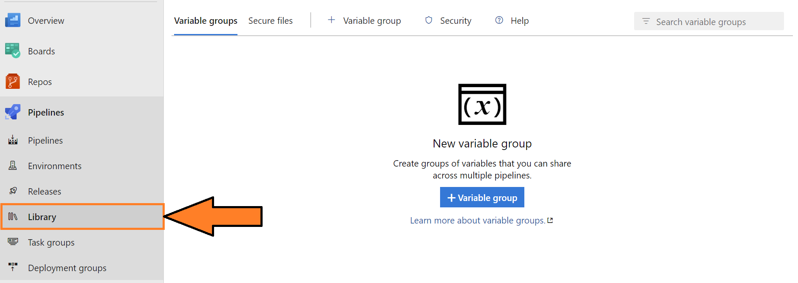
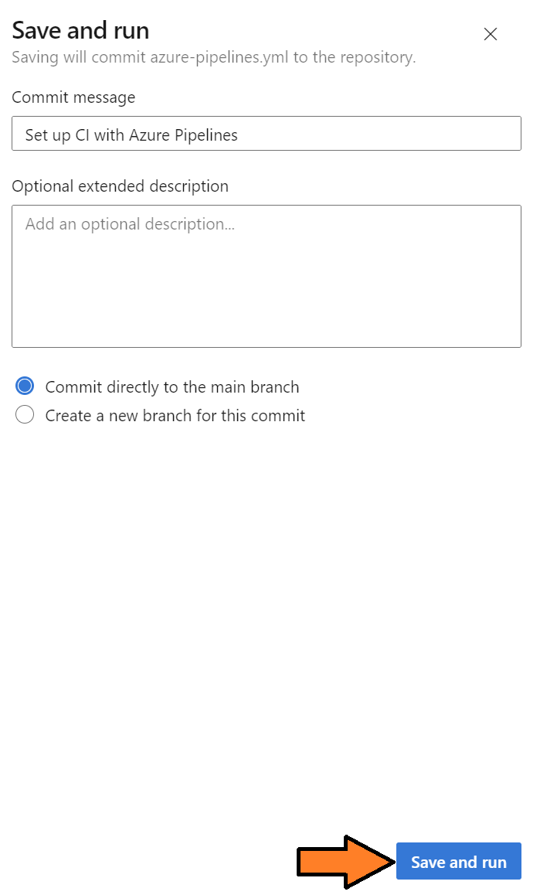
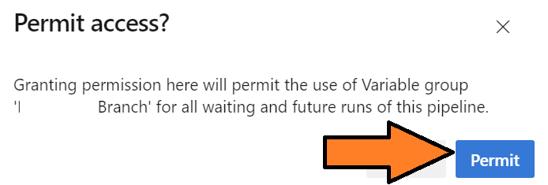

# Automating DAX Query View Testing Pattern

If you are using the [DAX Query View Testing Pattern](dax-query-view-testing-pattern.md) you can then look at automating the tests when a branch in your repository is updated and synced with a workspace through <a href="https://learn.microsoft.com/en-us/power-bi/developer/projects/projects-git" target="_blank">Git Integration</a>. The following instructions show you how to setup a pipeline to automate testing.

## Prerequisites

1. You have an Azure DevOps project and have at least Project or Build Administrator rights for that project.

2. You have connected a premium-back capacity workspace. Instructions are provided <a href="https://learn.microsoft.com/en-us/power-bi/developer/projects/projects-git" target="_blank">at this link.</a>

3. Your Power BI tenant has <a href="https://learn.microsoft.com/en-us/power-bi/enterprise/service-premium-connect-tools#enable-xmla-read-write" target="_blank">XMLA Read/Write Enabled</a>.

4. You have a service principal or account (username and password) with a Premium Per User license. If you are using a service principal you will need to make sure the Power BI tenant allows <a href="https://learn.microsoft.com/en-us/power-bi/enterprise/service-premium-service-principal#enable-service-principals">service principals are to use the APIs</a>. The service prinicipal or account with at least the Viewer role to the workspace.

## Instructions

### Create the Variable Group

1. In your project, navigate to the Pipelines->Library section.

1. Select the "Add Variable Group" button.

3. Create a variable group called "ProductionBranch" and create the following variables:

- WORKSPACE_NAME - The display name for the workspace.
- USERNAME_OR_CLIENTID - The service principal's application/client id or universal provider name for the account.
- PASSWORD_OR_CLIENTSECRET - The client secret or password for the service principal or account respectively.

4. Save the variable group.

### Create the Pipeline

1. Navigate to the pipeline interface.

2. Select the "New Pipeline" button.

3. Select the Azure Repos Git option.

4. Select the repository you have connected the workspace via Git Integration.

5. Copy the contents of template YAML file located <a href="https://raw.githubusercontent.com/kerski/fabric-dataops-patterns/development/Azure%20DevOps/Automated%20Testing%20Example/Run-DaxTests.yml" target="_blank">at this link</a>.

6. Select the 'Save and Run' button.

7. You will be prompted to commit to the main branch. Select the 'Save and Run' button.

8. You will be redirect to the first pipeline run, and you will be asked to authorize the pipeline to access the variable group created previously.  Select the 'View' button.

9. A pop-up window will appear. Select the 'Permit' button.

10. You will be asked to confirm.  Select the 'Permit' button.

11. This will kick off the automated testing.

12. Select the "Automated Testing Job"

13. You will see a log of DAX Queries that end in .Tests or .Test running against their respective semantic models in your workspace.

14. For any failed tests, this will be logged to the job, and the pipeline will also fail.

