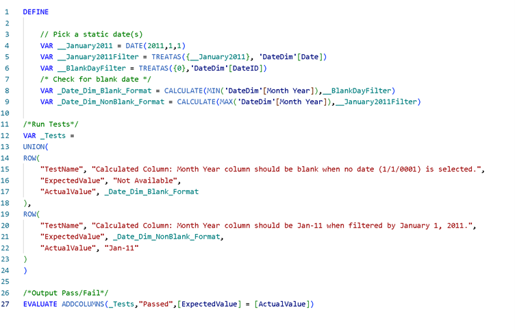
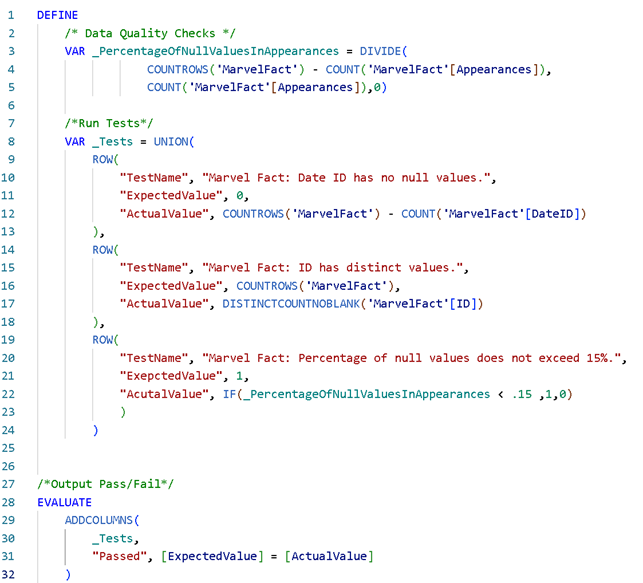
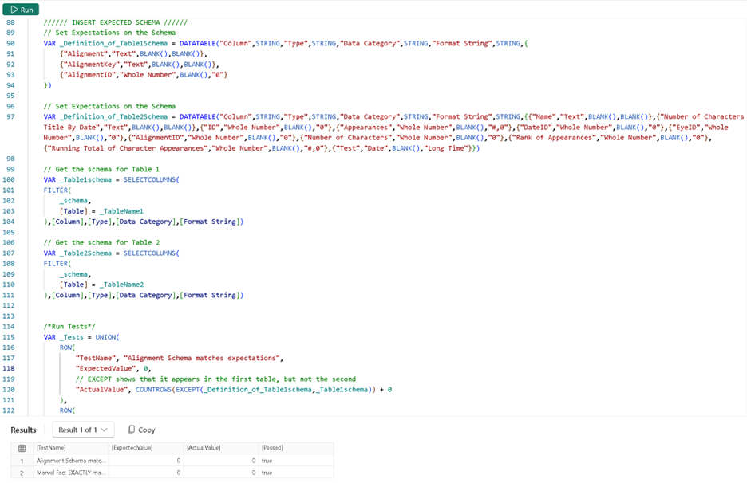

# DAX Query View Testing Pattern
In the world of actual, tangible fabrics, a pattern is the template from which the parts of a garment are traced onto woven or knitted fabrics before being cut out and assembled.  I’d like to take that concept and introduce a pattern for Microsoft Fabric, the DAX Query View Testing Pattern. 

My hope is that with this pattern you have a template to weave DataOps into Microsoft Fabric and ultimately have a quality solution for your customers.

1. [Steps](#steps)
    1. [Setup Workspace Governance](#1-setup-workspace-governance)
    1. [Standardize Schema and Naming Conventions](#2-standardize-schema-and-naming-conventions)
    1. [Build Tests](#3-build-tests)

## Steps

To follow the DAX Query View Testing Pattern you must follow these steps

1.	Setup Workspace Governance
2.	Standardize Schema and Naming Conventions
3.	Build Tests

### 1. Setup Workspace Governance

To get started we need to distinguish tests by their intended Power BI or Fabric workspace. This requires instituting workspace governance. You should at a minimum have two workspaces, one for development (DEV) and one for production (PROD). For larger projects, you should have a workspace for clients/customers to test (TEST) before moving to production. If you are unfamiliar with the concept please read this wiki article.

Your DEV workspace should have a static or be parameterized in order to create a stable state to build your tests. To test effectively you need to have a known underlying set of data to validate your semantic model. For example, if your upstream data is Fiscal Year-based, you could parameterize your tests to look at a prior Fiscal Year where the data should be stable. The goal is to have a static set of data to work with, so the only variables that would change during a test is the code you or your team has changed in Power BI.

Your TEST/PROD workspace is not static and considered live. Tests in this workspace are looking to conduct health checks (is there data in the table?) and identify data drift.

### 2. Standardize Schema and Naming Conventions
With workspace governance in place, you then need to institute two standards when building tests:

1. **Standard Output Schema** - In this pattern all tests should be based on a standard tabular schema as shown in Table below.

| Column Name  | TestName | ExpectedValue | ActualValue | Passed|
| -------- | ------- |------- |------- |------- |
| Type      | String   | Any     | Any   | Boolean   |
| Description | Description of the test being conducted.    | What the test should result in. This should be a hardcoded value or function evaluated to a Boolean.  | The result of the test under the current dataset.  |  True if the expected value matches the actual value. Otherwise, the result is false. |

2. **Tab Naming Conventions** - Not only do we have a standard schema for the output of our tests, but we also make sure names of your tabs in the DAX query view has some organization. Here is the naming format I have started to use:
[name].[environment].test 

    -	[name] is no more than 15-20 characters long. DAX Query View currently expands the tab name to fit the text, but we want to be able to tab between tests quickly.
    -	[environment] is either DEV, TEST, PROD and represents the different workspaces to run the test against.  ALL is used where the same test should be conducted in all workspaces.
    -	Finally the suffix of ".tests" help us distinguish what is actually a test file versus working files.


### 3. **Build Tests**

With this standard schema and naming convention in place, you can build tests covering three main areas:

#### 1. Testing Calculations

Calculated Columns and Measures should be tested to make sure they behave as intended and handle edge cases. For example, let’s say you have a DAX measure 

```IF(SUM(‘TableX’[ColumnY])<0,”Condition 1”,”Condition 2”)```

To test properly you should create conditions to test when:
    -	The summation is > 0
    -	The summation is = 0
    -	The summation is < 0
    -	The summation is blank

Screenshot below is an example of running tests for calculations.

#
*Example of tests for calculations like DAX measures and calculated columns.*

#### 2. Testing Content

Knowing that your tables and columns have the appropriate content is imperative. If you ever accidentally kept a filter in Power Query that was only intended for debugging/developing, you know testing content is important. Here are some tests you could run with this pattern:
    -	The number of rows in a fact table is greater than or equal to a number.
    - The number of rows in a dimension is not zero.
    - The presence of a value in a column that shouldn't be there.
    - The existence of blank columns.
    - The values in a custom column are correct.

#
*Example of testing content of your tables and columns.*
Note: Regex expressions still can’t be ran against content in columns within DAX syntax. I have an alternative approach to that <a href="https://www.kerski.tech/bringing-dataops-to-power-bi-part23/" target="_blank">in this article</a>.


#### 3. Testing Schema
With the introduction of <a href="https://powerbi.microsoft.com/en-us/blog/dax-query-view-introduces-new-info-dax-functions/" target="_blank">INFO functions in DAX</a>, testing the schemas of your semantic model is finally that much easier. Schema testing is important because it helps you avoid two common problems (1) Broken visuals and (2) Misaligned Relationships.

Changing names with columns and DAX measures break visuals that expect the columns spelt a certain way. This is especially troublesome if you have one dataset and multiple reports or report authors. 

In addition, with a click of a button you can change a column from numeric to text. That may seem benign but what if a relationship with that column was with another table's numeric column? You got issues, and not an easy one to figure out (trust me, I wasted hours trying to resolve an issue only to realize this was the root problem). 

So to test schemas, you need to establish a baseline schema for each table. These patterns show how to run schema checks against a semantic model. 

Dependencies: At least the December 2023 version of Power Desktop and [DAX Query View](https://learn.microsoft.com/en-us/power-bi/transform-model/dax-query-view).  Please make sure to turn on DAX Query View and PBIP preview features on.

[Schema.Tests.dax](./Semantic%20Model/SampleModel.Dataset/DAXQueries/Schema.Tests.dax): Example of running schema tests against a sample dataset.

[Schema Query Example](./Semantic%20Model/SampleModel.Dataset/DAXQueries/Schema%20Query%20Example.dax): Example of generating the DataTable syntax for the expected value part of the test case.

#
*Example of running tests against your semantic model's schema.*


